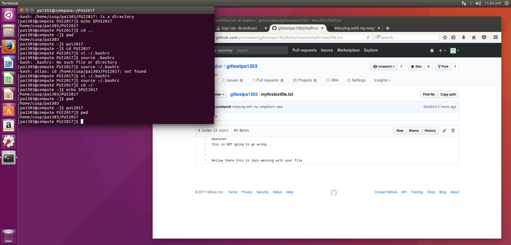

# PUI2017_pa1303
To set up the environment I first accessed the compute server. From there I used mkdir to create the PUI2017 directory. I then used vi to create the environmental variable that gave the location to the path of PUI2017. Finally I created an alias that would set the location to the environmental variable.

